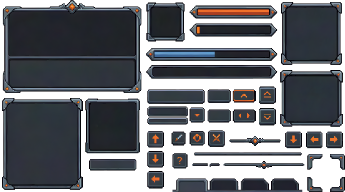
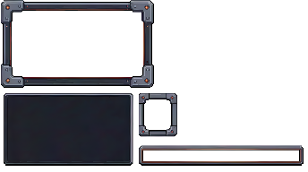

# Gameplay GUI

Last reviewed: 2026-06-25.



This example shows prompt iteration for PixelLab Pip's REST v2 UI generator. A first, narrower mood prompt produced an attractive but incomplete UI sample; a second prompt that named the exact gameplay components produced a much stronger transparent GUI kit with avatar and window frames, health-style bars, panels, reusable buttons, icon buttons, arrows, slots, dividers, and HUD trim.

## Request

Initial:

```text
pip, create deep charcoal slate, framed by cool iron and ignited by sharp hits of heath-fire orange game UI at 344x192 resolution
```

Follow-up:

```text
create a new generation for full gameplay GUI:
- avatar
- health bar
- window
- various buttons
- other useful elements
```

## Bad Example: Mood-Only Prompt



This pass matched the desired palette and material mood, but it did not specify the gameplay elements that should appear. The output is a small UI sheet with a panel, a smaller frame, and a bar, rather than a full gameplay GUI kit.

Route: PixelLab REST v2 `generate-ui-v2`

Controls:

| Field | Value |
|---|---|
| Image size | `344x192` |
| Background | `no_background: true` |
| Color palette | `deep charcoal slate, cool iron gray, dark gunmetal, small sharp heath-fire orange glow accents` |
| Usage reported | `20` subscription generations |

Initial prompt:

```text
pip, create deep charcoal slate, framed by cool iron and ignited by sharp hits of heath-fire orange game UI at 344x192 resolution
```

Enhanced prompt sent as `description`:

```text
Pixel art game UI panel frame, 344x192 canvas, deep charcoal slate central panel, beveled cool iron border and corner brackets, sharp heath-fire orange glowing accents on rivets, notches, and thin trim lines, readable RPG HUD/menu frame, crisp hard pixel edges, high contrast, transparent outside the frame, no text, no characters, no background scene.
```

Request body:

```json
{
  "description": "Pixel art game UI panel frame, 344x192 canvas, deep charcoal slate central panel, beveled cool iron border and corner brackets, sharp heath-fire orange glowing accents on rivets, notches, and thin trim lines, readable RPG HUD/menu frame, crisp hard pixel edges, high contrast, transparent outside the frame, no text, no characters, no background scene.",
  "image_size": {
    "width": 344,
    "height": 192
  },
  "no_background": true,
  "color_palette": "deep charcoal slate, cool iron gray, dark gunmetal, small sharp heath-fire orange glow accents"
}
```

## Good Example: Component-Specific Prompt


Route: PixelLab REST v2 `generate-ui-v2`

Controls:

| Field | Value |
|---|---|
| Image size | `688x384` |
| Background | `no_background: true` |
| Color palette | `deep charcoal slate, cool iron gray, dark gunmetal, blackened steel, sharp heath-fire orange ember accents` |
| Usage reported | `40` subscription generations |

Initial prompt:

```text
create a new generation for full gameplay GUI:
- avatar
- health bar
- window
- various buttons
- other useful elements
```

Enhanced prompt sent as `description`:

```text
Complete pixel art gameplay GUI kit sheet on a 688x384 canvas, deep charcoal slate and cool iron fantasy interface with sharp heath-fire orange accent lights. Include a square avatar portrait frame, horizontal health bar, mana or stamina bar, large ornate window/dialogue panel, inventory slot frame, minimap frame, quest/objective panel, several reusable buttons in different sizes, icon button frames, tabs, dividers, corner brackets, scroll arrows, and small useful HUD elements. Cohesive RPG action game UI, crisp hard pixel edges, beveled iron trim, dark slate surfaces, bright orange ember highlights, organized as separate usable elements on transparent background, no readable text, no characters, no scene background.
```

Request body:

```json
{
  "description": "Complete pixel art gameplay GUI kit sheet on a 688x384 canvas, deep charcoal slate and cool iron fantasy interface with sharp heath-fire orange accent lights. Include a square avatar portrait frame, horizontal health bar, mana or stamina bar, large ornate window/dialogue panel, inventory slot frame, minimap frame, quest/objective panel, several reusable buttons in different sizes, icon button frames, tabs, dividers, corner brackets, scroll arrows, and small useful HUD elements. Cohesive RPG action game UI, crisp hard pixel edges, beveled iron trim, dark slate surfaces, bright orange ember highlights, organized as separate usable elements on transparent background, no readable text, no characters, no scene background.",
  "image_size": {
    "width": 688,
    "height": 384
  },
  "no_background": true,
  "color_palette": "deep charcoal slate, cool iron gray, dark gunmetal, blackened steel, sharp heath-fire orange ember accents"
}
```

## Outputs

| File | Purpose |
|---|---|
| [`gameplay-gui/gameplay-gui-mood-only-344x192.png`](gameplay-gui/gameplay-gui-mood-only-344x192.png) | First-pass mood-focused UI sheet. Useful as a bad example for underspecified gameplay GUI requests. |
| [`gameplay-gui/gameplay-gui-component-specific-688x384.png`](gameplay-gui/gameplay-gui-component-specific-688x384.png) | Transparent full gameplay GUI kit sheet. |

## Validation Notes

Final verification:

- PNG dimensions: `688x384px`.
- Pixel format: `Format32bppArgb`.
- Output has transparent background and separate GUI elements arranged as a reusable sheet.
