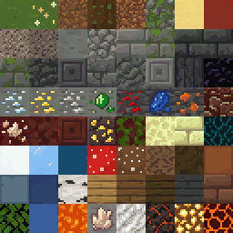
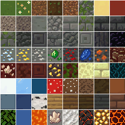

# Tiles

Last reviewed: 2026-07-01.



PixelLab Pip can showcase tile workflows from several surfaces: Create Image Pro texture sheets, `create_tiles_pro` tile variants, top-down Wang tilesets, sidescroller tilesets, and isometric tiles. The current best Create Image Pro example uses REST `generate-image-v2` to generate 64 original `32x32` tile images, then assembles those PixelLab outputs into an exact `8x8`, `256x256` spritesheet without repainting.

## Contents

- [Create Image Pro: Minecraft Mod 32px Terrain Pack](#create-image-pro-minecraft-mod-32px-terrain-pack)
- [Findings](#findings)
- [Showcase Assets](#showcase-assets)
- [Validation Notes](#validation-notes)

## Create Image Pro: Minecraft Mod 32px Terrain Pack


Grid inspection preview:



Original prompt:

```text
/pixellab-pip create a 64-tile Minecraft-inspired 32x32 terrain pack.
```

The Minecraft mod terrain pack is the recommended Create Image Pro tile showcase. Instead of asking one large generated image to obey tiny cell boundaries, the workflow generated `64` original PixelLab images at `32x32`, then locally arranged those original tiles into an exact `8x8` sheet. The assembled sheet is a stable showcase artifact, and the grid inspection preview makes the 32px cell boundaries easy to audit.

Route: PixelLab REST v2 `generate-image-v2`, surfaced in product language as Create Image Pro.

Prompt preparation: agent-optimized from the user's Minecraft tile-pack request.

Local processing: 64 original PixelLab `32x32` PNGs were arranged into an `8x8` sheet without repainting, resizing, quantization, or procedural visual fixes.

Generation details:

| Field | Value |
|---|---|
| Image size | `32x32` per generated tile |
| Tile count | `64` |
| Final sheet | `8x8`, `256x256` |
| Background | `no_background: false` |
| Seed | `1323610680` |
| Usage reported | `20` generations |
| Balance observation | `1564.25 -> 1544.25` generations |

Natural-language generation input:

```text
Varied Minecraft mod terrain block top-face textures, seamless 32x32 orthographic voxel-inspired tiles, no text/icons/borders/perspective.
```

Request settings:

```json
{
  "image_size": {
    "width": 32,
    "height": 32
  },
  "no_background": false,
  "seed": 1323610680
}
```

Findings:

- Generating original `32x32` tiles and assembling them locally produced a reliable sheet layout.
- The final spritesheet is exactly `256x256` and divides cleanly into `8x8` cells of `32x32`.
- Every tile was generated by PixelLab; local work only arranged original outputs into a sheet and produced an inspection preview.
- The generated set is well suited to a Minecraft-inspired terrain pack because each source tile has the intended native size.
- This is still a texture-pack workflow, not a Wang/autotile terrain-transition workflow.

## Findings

Create Image Pro / REST `generate-image-v2` is useful for tile packs when the workflow generates each tile at the intended tile size first, then assembles the selected original outputs into a sheet. This avoids relying on one large prompt-guided image to respect many small cell boundaries.

For exact tile layouts below `32px`, prefer tile-specific routes or ask the user to confirm the Create Image Pro tradeoff first. For `32px` tile packs, generating individual native-size tiles gives a cleaner verification path than asking for one dense grid image.

Future tile showcases should live on this page when they cover different tile surfaces, including:

- Top-down Wang/autotile terrain from REST `create-tileset` or MCP `create_topdown_tileset`.
- Sidescroller/platformer terrain from REST `create-tileset-sidescroller` or MCP `create_sidescroller_tileset`.
- Individual tile variants from REST `create-tiles-pro` or MCP `create_tiles_pro`.
- Single isometric tiles from REST `create-isometric-tile` or MCP `create_isometric_tile`.

Prompt language that helped:

- `64-tile ... terrain pack` anchors the requested count.
- `32x32` as the generated image size makes each source tile auditable before assembly.
- `Orthographic voxel-inspired tiles` keeps the block-top texture read without perspective.
- `No text/icons/borders/perspective` helps avoid UI/icon artifacts and camera-angle drift.

## Showcase Assets

| Output | Stable showcase file |
|---|---|
| Minecraft mod 32px terrain spritesheet | `docs/showcase/tiles/minecraft-mod-generate-image-v2-8x8-32px-sheet.png` |
| Grid inspection preview | `docs/showcase/tiles/minecraft-mod-generate-image-v2-8x8-32px-grid-inspection.png` |

## Validation Notes

- `64` generated tiles were retained.
- Each generated tile is exactly `32x32`.
- The assembled sheet is exactly `256x256`.
- The sheet divides exactly into an `8x8` grid of `32x32` cells.
- All `64` tiles have unique PNG hashes.
- All `64` tiles are fully opaque with full-square coverage.
- No local repainting, resizing, quantization, cleanup, or procedural visual fixes were applied to the tile pixels.
